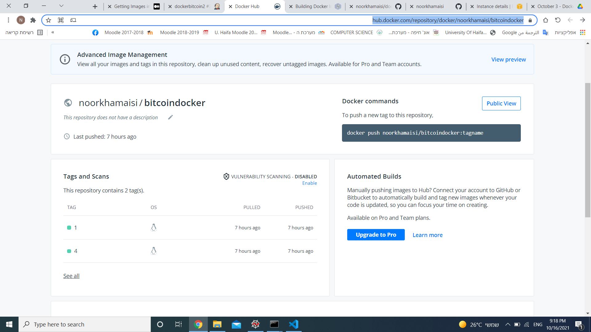

## BITCOIN APP :
Welcome to my python (flask) app that shows to the  users  the value of bitcoin in USD ($), and also presents the average value of the bitcoin price in the last 10 minutes.

 ### To use the application locally: 
 1. You  need to clone the app: git clone https://github.com/noorkhamaisi/dockerbitcoin.git
 2. You need to move the directory bitcoin: cd dockerbitcoin.
 3. install the requirements folder : pip install -r requirements.txt
 4. run the app using: python main.py the app is now ready to use, please visit: http://localhost:5000/

 ### Building and running the app with docker:
 1. clone the project from github  https://github.com/noorkhamaisi/dockerbitcoin.git
 2. building the image using : docker build -t bitcoindocker -f Dockerfile .
 3. running the image :  docker run -it -d -5000:5000 bitcoindocker
 4. the app is now ready to use , please visit  http://localhost:5000/ 

 ### Pushing app to dockerhub with jenkins:

 if you want to push the application to dockerhub by jenkins pipeline , please visit https://dzone.com/articles/building-docker-images-to-docker-hub-using-jenkins and follow the steps , you can see the result in my dockerhub - https://hub.docker.com/repository/docker/noorkhamaisi/bitcoindocker
  
you can also see the the code of the jenkinsfile in my github directory in the link that mentioned above . 

Here is a result of the project : 

###### Noor Khamaisi

